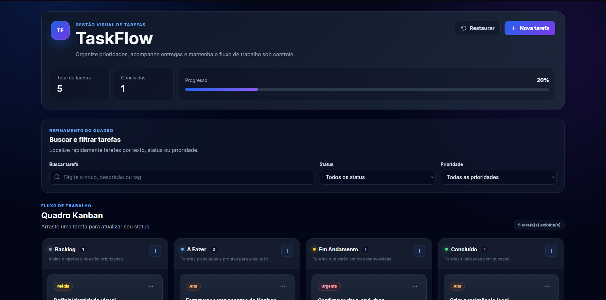

# TaskFlow

Sistema Kanban desenvolvido com React, TypeScript e Vite para gerenciamento visual de tarefas e acompanhamento de fluxo de trabalho.

O projeto permite criar, editar, excluir, pesquisar, filtrar e movimentar tarefas entre diferentes etapas por meio de drag-and-drop.

## Demonstração




```text
https://seu-link.vercel.app
```

## Funcionalidades

- Criação de tarefas
- Edição de tarefas
- Exclusão com confirmação
- Modal completo de detalhes
- Quadro Kanban com quatro colunas
- Drag-and-drop entre colunas
- Filtro por status
- Filtro por prioridade
- Busca por título, descrição e tags
- Prioridades baixa, média, alta e urgente
- Datas de vencimento
- Destaque para tarefas atrasadas
- Identificação de tarefas que vencem hoje
- Ordenação por prioridade e prazo
- Persistência em localStorage
- Interface responsiva
- Navegação por teclado
- Validação de dados armazenados
- Estados vazios e feedback visual

## Colunas do Kanban

- Backlog
- A Fazer
- Em Andamento
- Concluído

## Tecnologias

- React
- TypeScript
- Vite
- CSS
- dnd-kit
- React Icons
- localStorage

## Arquitetura

```text
src/
├── components/
│   ├── DeleteTaskModal/
│   ├── Filters/
│   ├── Header/
│   ├── KanbanBoard/
│   ├── KanbanColumn/
│   ├── TaskCard/
│   ├── TaskDetailsModal/
│   └── TaskModal/
├── hooks/
│   └── useTasks.ts
├── services/
│   └── taskStorage.ts
├── types/
│   └── task.ts
├── utils/
│   ├── constants.ts
│   └── taskHelpers.ts
├── App.tsx
├── index.css
└── main.tsx
```

## Regras de negócio

As tarefas possuem:

- título;
- descrição;
- status;
- prioridade;
- prazo;
- tags;
- data de criação;
- data de atualização.

As tarefas são ordenadas primeiro pela prioridade:

```text
Urgente > Alta > Média > Baixa
```

Quando duas tarefas possuem a mesma prioridade, o prazo mais próximo aparece primeiro.

Tarefas concluídas deixam de ser apresentadas como atrasadas.

## Persistência

Os dados são armazenados no navegador utilizando:

```text
localStorage
```

Chave utilizada:

```text
taskflow:tasks
```

Antes do carregamento, os dados passam por validação para evitar falhas causadas por conteúdo inválido.

## Como executar o projeto

Clone o repositório:

```bash
git clone https://github.com/SEU-USUARIO/taskflow.git
```

Entre na pasta:

```bash
cd taskflow
```

Instale as dependências:

```bash
npm install
```

Execute o ambiente de desenvolvimento:

```bash
npm run dev
```

Acesse o endereço exibido no terminal:

```text
http://localhost:5173
```

## Build de produção

```bash
npm run build
```

Para visualizar o build localmente:

```bash
npm run preview
```

## Decisões técnicas

### TypeScript

O TypeScript foi utilizado para tipar tarefas, propriedades dos componentes, filtros, status e prioridades.

### Componentização

A interface foi dividida em componentes com responsabilidades específicas, reduzindo acoplamento e facilitando manutenção.

### Hook de domínio

O hook `useTasks` centraliza as regras relacionadas às tarefas:

- criação;
- atualização;
- exclusão;
- movimentação;
- contadores;
- persistência.

### Drag-and-drop

O drag-and-drop foi implementado com `dnd-kit`, permitindo movimentação entre as colunas do Kanban.

### Responsividade

Em telas menores, as colunas são apresentadas em um fluxo horizontal com rolagem controlada.

## Melhorias futuras

- Autenticação de usuários
- API Back-End
- Sincronização com banco de dados
- Múltiplos quadros
- Subtarefas
- Comentários
- Histórico de movimentações
- Colaboração em tempo real
- Tema claro e escuro
- Testes automatizados

## Autor

Desenvolvido por **Caio Rocha**.

Projeto criado para demonstração de competências em desenvolvimento Front-End, React, TypeScript, arquitetura de componentes, gerenciamento de estado, persistência local e experiência do usuário.